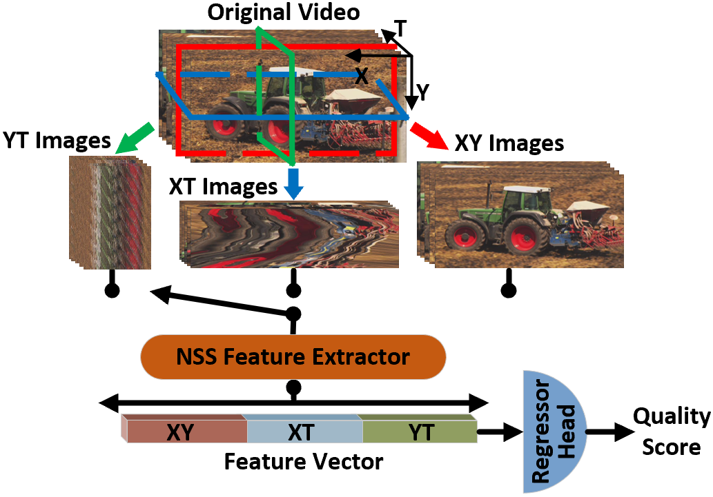
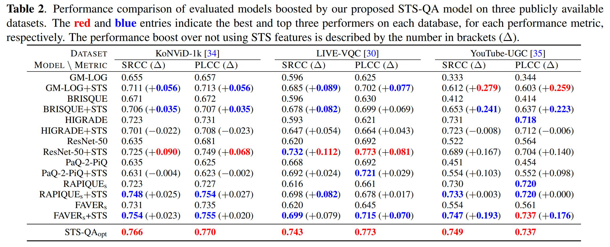

<div align="center">
  <h1><a href="https://ieeexplore.ieee.org/document/9897565">Blind Video Quality Assessment via Space-Time Slice Statistics</a></h1> 
  

<div>
      Qi Zheng<sup>1</sup>,
      Zhengzhong Tu<sup>2</sup>,
      Zhijian Hao<sup>1</sup>,
      Xiaoyang Zeng<sup>1</sup>,
      Alan C. Bovik<sup>2</sup>,
      Yibo Fan<sup>1</sup>
  </div>
  <div>
  <sup>1</sup>Fudan University, <sup>2</sup>The University of Texas at Austin
       </div> 
<br/>
<div>
    <b>2022 IEEE International Conference on Image Processing (ICIP)</b>
</div> 

  <h2>Framework</h2> 

<div style="width: 50%; text-align: center; margin:auto;">
      
</div>

<h2>Main Results</h2> 
<div style="width: 90%; text-align: center; margin:auto;">
      
</div>

</div>

## Quicker Start 
### 1. Compute XY, XT, and YT features
```shell
run src/compute_STS_features.m
```

### 2. Optimal features 
Optimal feature sets of XY, XT, and YT on three evaluated database are provided in ./features.

### 3. Performance Evaluation
```shell
bash run_all_bvqa_regression_by_content.sh
```

## Citation

```bibtex
@INPROCEEDINGS{zheng22stsbvqa,
  author={Zheng, Qi and Tu, Zhengzhong and Hao, Zhijian and Zeng, Xiaoyang and Bovik, Alan C. and Fan, Yibo},
  booktitle={2022 IEEE International Conference on Image Processing (ICIP)}, 
  title={Blind Video Quality Assessment via Space-Time Slice Statistics}, 
  year={2022},
  pages={451-455},
  keywords={Codes;Statistical analysis;Databases;User-generated content;Predictive models;Feature extraction;Distortion;Video quality assessment;natural video statistics;space-time slice;user-generated content},
  doi={10.1109/ICIP46576.2022.9897565}}
```
